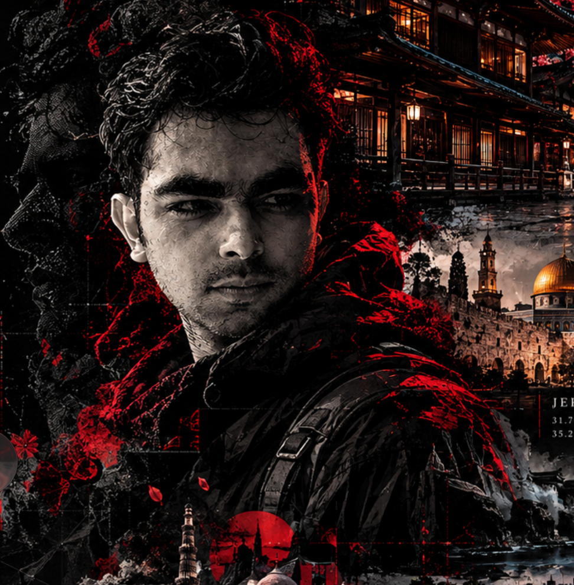

# Aniket Thakur · AI Researcher & Associate Product Manager

[](https://07anishu12.github.io) [](LICENSE)

> **Building AI systems, products, and intelligent workflows.**
> Applied AI engineer who ships product — and a PM who can build the model.



## About

This is the personal portfolio website of **Aniket Thakur**, based in New Delhi, India. It represents work across the convergence of **AI Engineering × Product Ownership × Financial Engineering**: Generative AI, Graph Neural Networks, fintech lending workflows, and the product ownership required to translate machine learning into real-world business outcomes.

Aniket is an Associate Product Manager at Drivio Technologies (previously Business Analyst), conducted AI research on Graph Neural Networks and multi-LLM data synthesis at Okinawa Institute of Science and Technology (OIST) in Japan, and consulted on startup GTM and financial analysis at Analy Assist. He is an M.Sc. Financial Engineering candidate at WorldQuant University and graduated with a B.Sc. in Data Analytics from DSEU Shakarpur-2 (GPA 3.82/4.0, Rank 2).

## Live Site

**[https://07anishu12.github.io](https://07anishu12.github.io)**

The repository is structured for GitHub Pages at the root.

## Architecture

- **Home (`index.html`)** — Asymmetric editorial hero with full-resolution portrait, clean proof statistics, 3-pillar focus (AI, Product, Finance), featured Laya case study, secondary systems, career progression, OIST research monograph, education, and direct contact.
- **About (`about.html`)** — Comprehensive personal profile, current focus at Drivio, trajectory from New Delhi to Okinawa, categorized technical toolkit, and academic background.
- **Work (`work.html`)** — Case-study index highlighting Laya (70% cycle reduction), Prompt-Based Business Intelligence, osTicket AI automation, and Multi-LLM Orchestration with structured problem, approach, tech, and verified outcome cells.
- **Learnings (`learnings.html`)** — Clean editorial state with categorized topics (AI Engineering, Fintech, Product, Research) and dynamic data rendering.
- **Contact (`contact.html`)** — Direct contact information (email, phone, international WhatsApp, socials) paired with a static WhatsApp enquiry workflow and prefilled email fallback.

## Design System

- **Light-First Editorial Palette:** Warm ivory canvas (`#FAF9F6`), crisp surface cards (`#FFFFFF`), deep charcoal typography (`#121316`), and sophisticated sapphire accent (`#1D4ED8`).
- **Typography:** `Plus Jakarta Sans` for modern geometric clarity, `Newsreader` (italic serif) for editorial nuance, and `JetBrains Mono` for select metadata and code tags.
- **Whitespace & Rhythm:** Large intentional negative space, fine hairline dividers, and asymmetric editorial balance rather than repetitive dashboard boxes.
- **Accessibility:** Semantic HTML5 landmarks, single H1 per page, high WCAG contrast, visible focus rings, skip link, and `prefers-reduced-motion` compliance.

## Directory Structure

```text
Portfolio-Website/
├── index.html
├── about.html
├── work.html
├── learnings.html
├── contact.html
├── assets/
│   ├── Aniket_Thakur_Resume.pdf
│   ├── css/
│   │   └── style.css
│   ├── js/
│   │   └── main.js
│   └── img/
│       └── aniket-portrait.png
├── data/
│   ├── assistant.json
│   ├── contact.json
│   ├── experience.json
│   ├── learnings.json
│   ├── projects.json
│   └── skills.json
├── sitemap.xml
├── robots.txt
├── README.md
├── LICENSE
└── .nojekyll
```

## Contact

- **Email:** [kumaraniketn@gmail.com](mailto:kumaraniketn@gmail.com)
- **Phone (India):** [+91 8448769791](tel:+918448769791)
- **WhatsApp (International):** [+81 70-1290-5081](https://wa.me/817012905081)
- **GitHub:** [github.com/07anishu12](https://github.com/07anishu12)
- **LinkedIn:** [aniket-thakur-a23a9b372](https://www.linkedin.com/in/aniket-thakur-a23a9b372)
- **X:** [@07anni04](https://x.com/07anni04)

## License

MIT. See [LICENSE](LICENSE).
